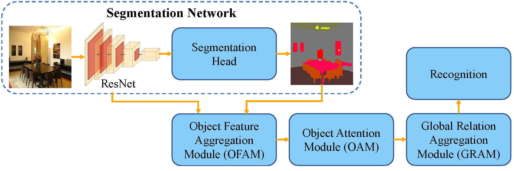

# Object-to-Scene: Learning to Transfer Object Knowledge to Indoor Scene Recognition

This repository contains the source code (PyTorch) for our paper:

**Object-to-Scene: Learning to Transfer Object Knowledge to Indoor Scene Recognition**




## Citation
```
@InProceedings{OTS21,
  author     = "Bo Miao and Liguang Zhou and Ajmal Mian and Tin Lun Lam and Yangsheng Xu",
  title      = "Object-to-Scene: Learning to Transfer Object Knowledge to Indoor Scene Recognition",
  booktitle  = "IEEE/RSJ International Conference on Intelligent Robots and Systems",
  year       = "2021",
}
```

## Pre-trained model
- The pre-trained model can be downloaded at [Google drive](https://drive.google.com/drive/folders/1WSJUyBDjm2K23dLylDoAhnJdNvqi6c-U?usp=sharing). 
- Put the pre-trained model in the `ckpt` folder.


## Introduction
- The entrance file of test codes is `main.py`.
- The main arguments and functions are in `functions.py`.


